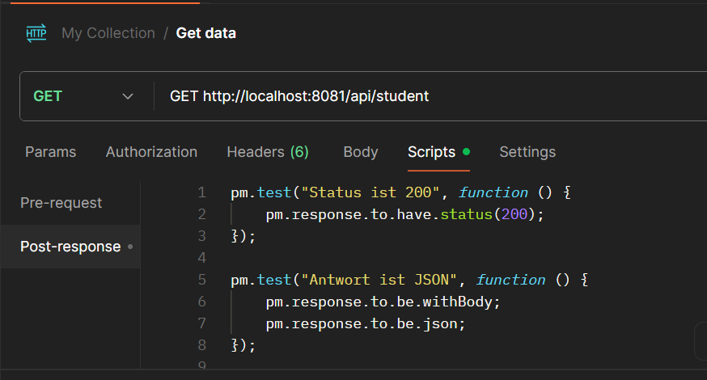
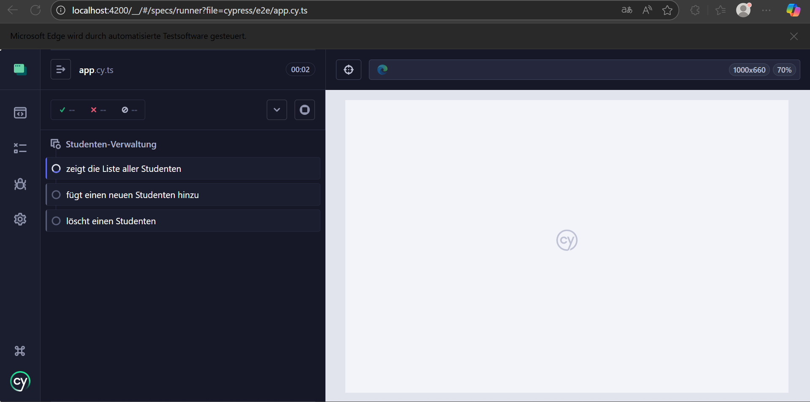

# Übung 1 – REST API Testen (Postman & Unit Tests)

## Ziel der Übung

In dieser Übung haben wir die Spring Boot Backend-Applikation gestartet und eine Möglichkeit gesucht, die REST-Schnittstelle automatisiert zu testen. Zwei unterschiedliche Herangehensweisen wurden umgesetzt:

1. **Testen mit Postman und Test-Skripten**
2. **Testen mit Java Unit Tests direkt im Code (JUnit)**

---

## Vorbereitung

1. **Projekt entpackt**: Die Datei `spring-boot-angular-basic-lw.zip` wurde entpackt.
2. **Backend gestartet**:
   ```bash
   cd backend
   ./mvnw spring-boot:run
   ```


3. Die Applikation war danach unter:

   ```
   http://localhost:8081/students
   ```

   erreichbar und lieferte JSON-Daten zurück:

   ```json
   [
     {
       "id": 1,
       "name": "Jonas",
       "email": "jonas@tbz.ch"
     },
     ...
   ]
   ```

---

## Lösung 1: Test mit Postman

Wir haben die REST-API mit **Postman** getestet.

### Anfrage

* **Methode**: `GET`
* **URL**: `http://localhost:8081/students`

### Tests (Postman-Script im Tab "Tests")

```javascript
pm.test("Status ist 200", function () {
    pm.response.to.have.status(200);
});

pm.test("Antwort ist JSON", function () {
    pm.response.to.be.withBody;
    pm.response.to.be.json;
});

pm.test("Es gibt mindestens 1 Student", function () {
    var jsonData = pm.response.json();
    pm.expect(jsonData.length).to.be.above(0);
});
```

### Ergebnis

✅ Alle Tests bestanden:

* Status: `200 OK`
* Format: JSON


---

## Lösung 2: Test mit JUnit (Kollege)

Mein Kollege hat die REST-API direkt über **JUnit Unit Tests** im Code getestet.

### Beispiel-Testklasse: `StudentControllerTest.java`

```java
@SpringBootTest
@AutoConfigureMockMvc
public class StudentControllerTest {

    @Autowired
    private MockMvc mockMvc;

    @Test
    public void testGetAllStudents() throws Exception {
        mockMvc.perform(get("/students"))
                .andExpect(status().isOk())
                .andExpect(content().contentType("application/json"))
                .andExpect(jsonPath("$", hasSize(greaterThan(0))));
    }
}
```

### Erklärung

* `MockMvc` wird verwendet, um HTTP-Requests im Testkontext zu simulieren.
* `@SpringBootTest` startet die Spring Boot-Anwendung für den Test.
* `jsonPath("$", hasSize(greaterThan(0)))` prüft, ob mindestens ein Student zurückkommt.

---

## Vergleich der Methoden

| Methode         | Vorteile                              | Nachteile                          |
| --------------- | ------------------------------------- | ---------------------------------- |
| **Postman**     | Schnell, einfach zu bedienen, visuell | Nicht im CI/CD automatisch nutzbar |
| **JUnit Tests** | Automatisierbar, Teil des Codes       | Etwas mehr Setup nötig             |

---

## Fazit

Beide Varianten haben erfolgreich gezeigt, wie man REST-APIs testen kann.
Für manuelles Testen und schnelles Feedback eignet sich **Postman** hervorragend.
Für automatisiertes Testen im Projekt eignet sich **JUnit mit MockMvc** besser.

Natürlich – hier ist die überarbeitete **Markdown-Dokumentation für Übung 2**, jetzt mit mehr Details zu den installierten Tools, warum Cypress verwendet wurde und was genau gemacht wurde – aber weiterhin im klaren, einfachen Stil wie bei Übung 1:


# Übung 2 – E2E Testen mit Cypress

## Ziel der Übung

In dieser Übung haben wir das **Frontend der Angular-Applikation** automatisiert im Browser getestet.  
Ziel war es, sogenannte **End-to-End-Tests (E2E)** umzusetzen – also Tests, die das gesamte Verhalten aus Sicht des Benutzers prüfen (z. B. Eingabe, Anzeige, Klicks, usw.).

Dazu haben wir das Test-Tool **Cypress** verwendet.

---

## Warum Cypress?

Cypress ist ein modernes Tool für End-to-End-Tests im Browser.  
Es eignet sich besonders gut für **Single Page Applications** wie Angular und bietet:

- Live-Testausführung im echten Browser
- Automatisches Warten auf Elemente (kein `setTimeout`)
- Klare Fehlermeldungen und Screenshots bei Fehlern
- Einfache API für Tests (`cy.get(...)`, `cy.type(...)`, `cy.click()` etc.)

---

## Vorbereitung

1. **Angular-Projekt gestartet**:
   ```bash
   cd frontend
   ng serve

2. **Cypress installiert** (falls nicht vorhanden):

   ```bash
   npm install cypress --save-dev
   ```

3. **Cypress geöffnet**:

   ```bash
   npx cypress open
   ```

4. **Testdatei erstellt**:
   Neue Datei `app.cy.ts` im Verzeichnis `cypress/e2e/` erstellt.

---

## Testfälle mit Cypress

Wir haben drei automatische Tests umgesetzt:

### 1. Studentenliste anzeigen

```ts
it('zeigt die Liste aller Studenten', () => {
  cy.visit('http://localhost:4200');
  cy.get('[data-testid="studenten-tabelle"]').should('exist');
  cy.get('[data-testid="studenten-zeile"]').should('have.length.at.least', 1);
});
```

### 2. Neuen Studenten hinzufügen

```ts
it('fügt einen neuen Studenten hinzu', () => {
  cy.visit('http://localhost:4200');
  cy.get('[data-testid="input-name"]').type('Mia');
  cy.get('[data-testid="input-alter"]').type('25');
  cy.get('[data-testid="button-speichern"]').click();
  cy.contains('Mia').should('exist');
});
```

### 3. Studenten löschen

```ts
it('löscht einen Studenten', () => {
  cy.visit('http://localhost:4200');
  cy.contains('Mia').parent().find('[data-testid="button-loeschen"]').click();
  cy.contains('Mia').should('not.exist');
});
```

---

## HTML-Anpassungen

Damit Cypress die Elemente findet, haben wir im HTML folgende `data-testid`-Attribute ergänzt:

```html

<table data-testid="studenten-tabelle">
  <tr *ngFor="let student of studenten; let i = index" data-testid="studenten-zeile">
    <td>{{ student.name }}</td>
    <td>{{ student.alter }}</td>
    <td><button data-testid="button-loeschen" (click)="deleteStudent(i)">Löschen</button></td>
  </tr>
</table>

<input data-testid="input-name" [(ngModel)]="neuerStudent.name" placeholder="Name" />
<input data-testid="input-alter" [(ngModel)]="neuerStudent.alter" type="number" placeholder="Alter" />
<button data-testid="button-speichern" (click)="addStudent()">Speichern</button>
```

---

## Ergebnis

Alle E2E-Tests wurden erfolgreich ausgeführt.

* Die Tabelle wurde korrekt geladen.
* Ein neuer Student konnte hinzugefügt werden.
* Der Student wurde wieder gelöscht.



Die Tests liefen automatisch im Browser und zeigten visuell jeden Schritt.

---

## Fazit

Mit Cypress konnten wir das Angular-Frontend realistisch und zuverlässig testen.
E2E-Tests sind besonders hilfreich, um die Benutzeroberfläche zu prüfen und Fehler frühzeitig zu finden – noch bevor echte Benutzer sie sehen.

Cypress ist ein ideales Werkzeug dafür und lässt sich gut in bestehende Angular-Projekte integrieren.
